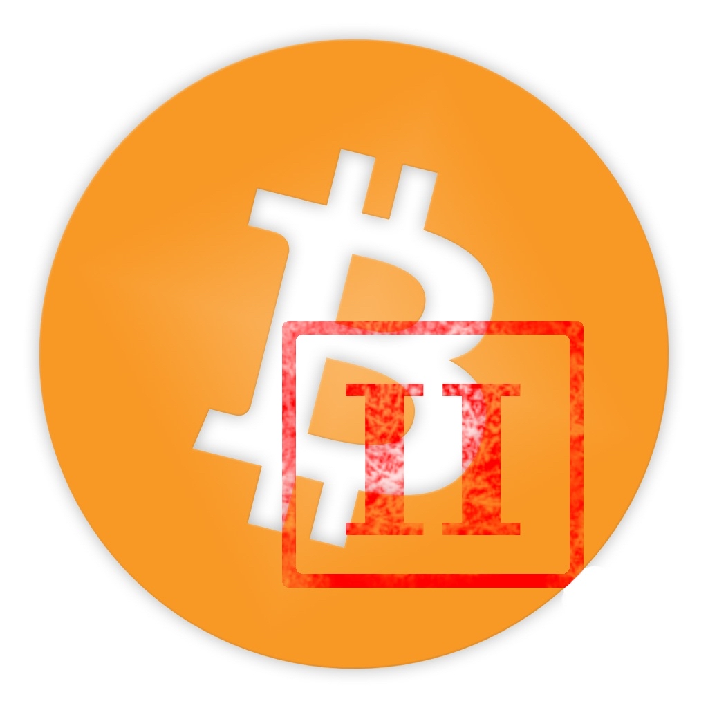

<p align="center">
  
</p>

<h1 align="center">BC2 Cold Wallet</h1>

<p align="center">
  Experimental, community-driven, BC2-only hardware cold wallet implementation.
</p>

> [!IMPORTANT]
> **BC2 Cold Wallet is not an official Bitcoin II (BC2) project or an official product of the Bitcoin II project/team.**
> It is an independent developer implementation created for the BC2 community.

## Project status

BC2 Cold Wallet is currently an **experimental community release**.

The project has **not been 100% penetration-tested and has not received an official independent security audit**. Do not treat the current release as an audited commercial hardware wallet. Start with small BC2 amounts and never use valuable production seeds for development, debugging, or testing.

The goal is intentionally narrow:

> **BC2 Cold Wallet Only**

The hardware protects the wallet seed/private keys and is used to review security-critical wallet operations. The desktop application provides the user interface and blockchain/network communication.

## Contributions

Developers are welcome to fork the repository, inspect and review the implementation, modify and improve the code, report bugs/security issues, and submit pull requests.

Contributions should remain aligned with the project's core goal: a **simple BC2-only cold wallet**. Please avoid turning the project into a multi-coin wallet or adding unrelated functionality.

## Security model

- One hardware device manages exactly one BC2 wallet at a time.
- New wallet seeds are generated and displayed on the hardware.
- Seed and private keys remain on the hardware during normal wallet operation.
- Security-critical actions are reviewed/confirmed on the hardware.
- The device PIN is exactly **4 numeric digits**.
- The wallet uses a USB connection between hardware and desktop.
- Wi-Fi and Bluetooth are not part of the wallet workflow.

Recovery is desktop-assisted: the user enters a 12- or 24-word recovery phrase in the desktop application, which validates it and transfers it to the hardware for recovery. The desktop must not persist or log the recovery phrase.

## Requirements

### Supported hardware

The current community implementation targets:

**Waveshare ESP32-S3-ePaper-1.54**
- ESP32-S3
- 1.54-inch e-paper display
- 200 × 200 resolution
- 8 MB flash configuration used by the current firmware target
- USB connection to the desktop

You also need a **USB data cable**, a computer for flashing/running the desktop wallet, **ESP-IDF 5.5.x**, and Python 3 with `venv` support.

> Use the exact supported Waveshare target. Other ESP32-S3/e-paper boards may have different pin mappings, displays, power management, buttons, or flash layouts and are not automatically compatible.

## Installation

### 1. Get the repository

```bash
git clone <YOUR-REPOSITORY-URL>
cd bc2-wallet-firmware-main
```

Or download the repository as a ZIP and extract it.

### 2. Activate ESP-IDF

After installing ESP-IDF 5.5.x:

```bash
. ~/esp/esp-idf/export.sh
```

### 3. Build the hardware firmware

```bash
cd firmware
./scripts/build-hardware.sh
```

Alternatively:

```bash
cd firmware/hardware/esp32s3_waveshare
idf.py fullclean
idf.py build
```

### 4. Flash the Waveshare device

Connect the device with a USB data cable:

```bash
cd firmware
./scripts/flash-hardware.sh
```

Or directly:

```bash
cd firmware/hardware/esp32s3_waveshare
idf.py -p /dev/ttyACM0 flash
```

Replace `/dev/ttyACM0` if your system uses another serial port. On Windows this can be a COM port such as `COM5`.

For diagnostics:

```bash
idf.py -p /dev/ttyACM0 monitor
```

Close the monitor before starting the desktop wallet so the serial port is free.

### 5. Start the desktop wallet

```bash
cd desktop
chmod +x run.sh
./run.sh
```

The desktop uses the Python dependencies provided by the repository, including PySide6, pyserial and QR-code support.

### 6. Connect

1. Flash the firmware.
2. Close any serial monitor.
3. Connect the Waveshare device by USB.
4. Start the desktop wallet.
5. Follow the instructions on the desktop and hardware.

The desktop supports **English** and **Deutsch** under **Settings → Language**. English is the default.

## User manual

For complete operating instructions see:

**[BC2 Cold Wallet User Manual](docs/USER_MANUAL.md)**

It covers wallet creation, recovery, unlock/lock, Receive, Send, Transactions, settings, PIN/lockdown behavior, troubleshooting and security recommendations.

## Experimental release warning

This repository is provided for community testing, development, review and experimentation. Cryptocurrency wallet software is security-sensitive. A working feature test does not prove that an implementation is secure against every attack.

**Use small amounts until the project has undergone broader security testing and an independent security audit.**
